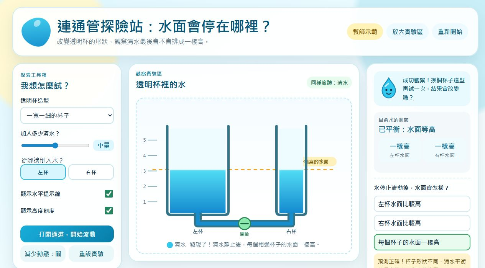
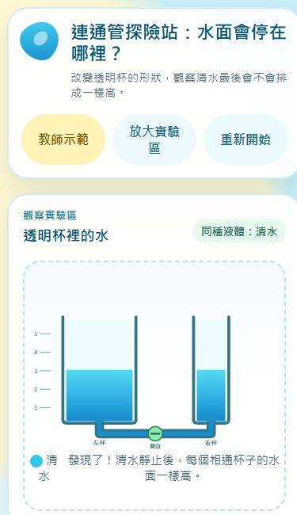

# 連通管探險站：水面會停在哪裡？

給國小中年級至高年級使用的 RWD 數位互動教材。學生可以改變透明杯造型、注水位置與水量，先預測再觀察同種液體在連通容器中最後液面等高的現象。

## 開啟教材

- GitHub Pages 網站啟用後：`https://prayer168.github.io/Connecting_pipe/`
- 本地使用：直接以瀏覽器開啟 `index.html`

## 內容

- 透明連通杯探索模擬與閘門流動動畫
- 小小水滴研究員提示
- 水平提示線、高度刻度與減少動態模式
- 兩個相通透明杯的圖文生活任務
- 三題學習檢核與完成徽章
- 適用桌機投影、平板與手機的 RWD 版面

## 預覽

### 桌機／投影

### 手機

## 教學範圍

第一版呈現清水、容器底部相通且上方開放的情境。動畫速度為教學示意，尚未包含不同密度液體、外加壓力、毛細作用或真實流速計算。

